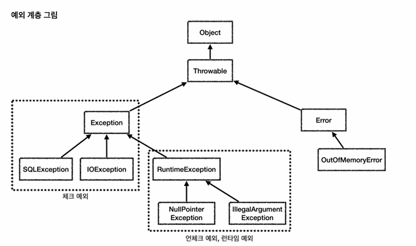

# Item 70 & 75

## Checked Exception VS UnChecked Exception(Runtime Exception)



- Checked Exception
    - 호출하는 쪽에서 복구하리라 여겨지는 상황이면 Checked Exception 사용
        
        ```jsx
        //IOException, SQLException 등 호출하는 쪽에서 예외가 발생했을 때 
        //유의미한 처리를 해야 한다면 Checked Exception을 사용
        
        try {
            // 연결 로직
        } catch (SQLException e) {
            // 연결 실패 시 네트워크 재연결 시도 로직
        }
        ```
        
    - Checked Exception은 호출하는 쪽에서 try-catch, throws 등 처리해주지 않는다면 컴파일 에러 발생
        
        ```jsx
        // 커스텀 checked exception 정의
        public class InsufficientFundsException extends Exception {
            public InsufficientFundsException(String message) {
                super(message);
            }
        }
        
        // 이 예외를 던지는 메서드
        public void withdraw(int amount) throws InsufficientFundsException {
            if (balance < amount) {
                throw new InsufficientFundsException("잔액 부족");
            }
            balance -= amount;
        }
        
        // 호출하는 쪽
        public void test() {
            withdraw(1000);  // ← 컴파일 에러 발생!
        }
        ```
        
    
- Unchecked Exception(Runtime Exception)
    - Runtime Exception은 호출하는 쪽에서 명시적으로 예외를 처리해주지 않아도 컴파일 에러가 발생하지 않음. 그러나 개발자의 실수로 처리하지 못하는 경우는 있을 수 있음.
    
    - 로직을 잘못 작성해 발생하는 NullPointerException 등의 예외들이 대부분이므로, 굳이 예외를 처리하지 않고 코드를 잘 검증해야 함.
    
    - 다만 사용자 입력, 재시도 로직, 배치작업(일부 실패해도 계속 진행) 등 필요한 경우라면 잡아서 처리해줘야 함.
        
        ```jsx
        
        // 사용자 입력은 계산기 프로그램에서 사용자가 0으로 나누려 하는 경우 처리 등
        // 배치 작업
        public void processBatch(List<Order> orders) {
            List<Order> failed = new ArrayList<>();
            
            for (Order order : orders) {
                try {
                    processOrder(order);
                } catch (RuntimeException e) {
                    // 하나 실패해도 다른 주문들은 계속 처리
                    log.error("주문 {} 처리 실패", order.getId(), e);
                    failed.add(order);
                }
            }
            
            // 실패한 주문들 별도 처리
            if (!failed.isEmpty()) {
                sendFailureReport(failed);
            }
        }
        ```
        
    
    - 다만, 책에서 말한 상황(자원 고갈 상황이 복구될 수 있는 상태)같은 경우라고 판단하면 Checked Exception 사용
        
        ```jsx
        // 커넥션 풀이 다 차서 사용 가능한 커넥션이 없는 상황
        public class ConnectionPoolExhaustedException extends Exception {
            private final int poolSize;
            private final int activeConnections;
            
            public int getPoolSize() { return poolSize; }
            public int getActiveConnections() { return activeConnections; }
        }
        
        // 사용
        try {
            connection = pool.getConnection();
        } catch (ConnectionPoolExhaustedException e) {
            // 복구: 잠시 대기 후 재시도
            Thread.sleep(100);
            connection = pool.getConnection();
            
            // 또는: 다른 풀 사용
            connection = backupPool.getConnection();
        }
        ```
        

- Exception, RuntimeException, Error를 상속하지 않는 throwable을 만들 수도 있지만 절대 사용하지 말 것

- AssertionError를 제외하고 Error를 상속하거나 던지는 일은 하면 안됨.
    
    → 해봤자 개발자가 할 수 있는게 없음
    
- 오류메시지를 사용할 때 파싱하지 않도록 예외 클래스에 정보를 얻을 수 있는 메서드(접근자) 구현 필요 (Item 12 참고)
    
    ```jsx
    // 정보가 없는 예외
    public class InsufficientFundsException extends Exception {
        public InsufficientFundsException(String message) {
            super(message);
        }
    }
    
    // 사용
    throw new InsufficientFundsException("잔액 부족: 현재 5000원, 필요 10000원");
    
    // 호출자가 정보를 얻으려면...
    try {
        withdraw(10000);
    } catch (InsufficientFundsException e) {
        // 나쁜 방법: 메시지 문자열을 파싱해야 함 😱
        String msg = e.getMessage();
        int current = parseCurrentBalance(msg);  // "5000원" 추출
        int needed = parseNeededAmount(msg);     // "10000원" 추출
        
        // 메시지 형식이 바뀌면? 다국어는? 완전 취약함!
    }
    
    // 정보를 제공하는 메서드가 있는 예외
    public class InsufficientFundsException extends Exception {
        private final int currentBalance;
        private final int requestedAmount;
        
        public InsufficientFundsException(int currentBalance, int requestedAmount) {
            super(String.format("잔액 부족: 현재 %d원, 필요 %d원", 
                              currentBalance, requestedAmount));
            this.currentBalance = currentBalance;
            this.requestedAmount = requestedAmount;
        }
        
        // 코드로 정보를 제공하는 메서드들
        public int getCurrentBalance() {
            return currentBalance;
        }
        
        public int getRequestedAmount() {
            return requestedAmount;
        }
        
        public int getShortfall() {
            return requestedAmount - currentBalance;
        }
    }
    
    // 사용
    throw new InsufficientFundsException(5000, 10000);
    
    // 호출자가 정보를 쉽게 활용
    try {
        withdraw(10000);
    } catch (InsufficientFundsException e) {
        int shortfall = e.getShortfall();
        System.out.println(shortfall + "원이 부족합니다.");
        
        // 복구 로직도 명확하게
        if (e.getCurrentBalance() > 0) {
            partialWithdraw(e.getCurrentBalance());
        }
    }
    ```
    

- 위 코드에서 좋은 예시를 확인하자. (Item 75)
    - 예외에 관여된 모든 매개변수와 필드값이 실패 메시지에 담겨있음.
    - 메시지를 길게 늘어놓지 않고 간결하게 적음.
    - 접근자 제공

- 예외 메시지는 개발자들이 보는 것이므로, 소비자 친화적 안내메시지보다는 담긴 데이터가 더 중요