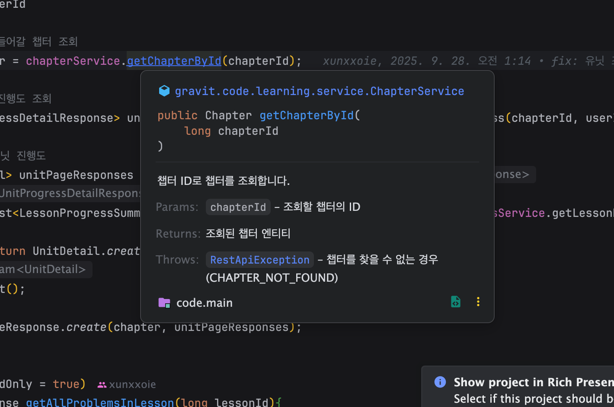

# Item74

> ***메서드가 던지는 모든 예외를 문서화하라***

<br>

## 문서화의 중요성

 문서화 그게 뭔데? 스웨거가 다 해주는거 아니야? 라고 생각할 수도 있다. 하지만, 소프트웨어의 품질을 높이고 협업에서의 장애를 최소화하기 위해 필수적으로 고려해야 하는 사항이라고 생각한다.

<br>

 만약, 본인이 운영 기간이 30년이 넘는 회사에 주니어 개발자로 일하게 되었다고 가정해보자. 첫주차에 선임분께서 ‘레거시 코드를 분석해보세요’ 하고 기껏해야 소스파일과 스웨거 던져주었는데, 소스파일에 문서화는 커녕 주석 단 한 개라도 안달려있었다면 멘붕이 올 것이다.

<br>

문서화는 장기적 유지보수와 소프트웨어의 품질 측면에서 굉장히 큰 파이를 차지하고 있는 것 같다.

<br>

## @throws

**Javadoc**은 **@throws** 태그를 제공하는데, 이 태그를 통해 해당 메서드가 어떤 타입의 예외를 반환하는지 명시할 수 있다.

```java
/**
 * 챕터 ID로 챕터를 조회합니다.
 *
 * @param chapterId 조회할 챕터의 ID
 * @return 조회된 챕터 엔티티
 * @throws RestApiException 챕터를 찾을 수 없는 경우 (CHAPTER_NOT_FOUND)
 */
public Chapter getChapterById(long chapterId){
    return chapterRepository.findById(chapterId)
            .orElseThrow(() -> new RestApiException(CustomErrorCode.CHAPTER_NOT_FOUND));
}
```

<br>

 그리고 호출부에서 확인해보면 해당 메서드가 어떤 예외를 반환하고, 파라메터로 어떤 것을 받고, 어떤 것을 반환하는지 확인할 수 있다.



<br>

**검사 예외**, 즉 호출부에서 반드시 try-catch로 처리해줘야 하는 예외는 메서드 시그니처에 **throws**로 명시해주고 **@throws** 태그를 통해 문서화해주자. 그리고 **비검사 예외**는 **@throws** 태그로만 문서화해주자.
