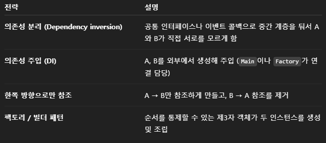

# Item 83

- 지연 초기화는 필드가 필요할 때 초기화하는 것
    - 사용되지 않으면 초기화하지 않음
    - 클래스의 필드에 매우 무거운 객체가 있다고 할 때, 자주 쓰이지 않는 경우 낭비가 심함 → 필요할 때 생성(지연초기화)
        
        ```jsx
        // 즉시 초기화
        class Example {
            private HeavyObject heavy = new HeavyObject(); 
        }
        
        // 지연 초기화
        class Example {
            private HeavyObject heavy;
        
            public HeavyObject getHeavy() {
                if (heavy == null) {
                    heavy = new HeavyObject(); // 필요할 때 생성
                }
                return heavy;
            }
        }
        
        ```
        
    - 순환 문제를 해결하는 효과도 있음. 하지만 이는 근본적인 순환 문제를 해결해주지 못함.
        
        ```jsx
        class A {
            static B b = new B(); // B를 만들면서 A가 필요
        }
        
        class B {
            static A a = new A(); // A를 만들면서 B가 필요
        }
        
        // 지연초기화 방식, 처음에 A를 생성해도 B는 당장 생성할 필요 없음
        // A의 필드 B가 필요해지면 B를 생성하겠지만, B를 생성해도 B 안의 필드 A는 당장 생성 X
        class A {
            private static B b;
        
            static B getB() {
                if (b == null)
                    b = new B(); // 필요할 때만 생성
                return b;
            }
        }
        
        class B {
            private static A a;
        
            static A getA() {
                if (a == null)
                    a = new A(); // 필요할 때만 생성
                return a;
            }
        }
        
        ```
        
    - 지연 초기화하는 필드는 접근 비용이 커짐.
        
        → 필드에 접근할 때마다 if문을 거쳐야 하기 때문
        
    
    - 순환 문제를 근본적으로 해결하기 위해 활용할 수 있는 방법은 아래와 같음.
        
        
        

- 정적 필드 지연 초기화
    
    ```jsx
    private static class FieldHolder{
    	static final FieldType field = computeFieldValue();
    }
    
    private static FieldType getField() {return FieldHolder.field;}
    ```
    
    → static class는 외부에서 접근하기 전까지 JVM에서 초기화를 하지 않음. (JVM이 지연초기화 해줌)
    
    → 클래스 초기화(static)는 단 하나의 스레드에서만 수행됨. (synchronized 필요없음)
    
    → 코드만 보면 지연 초기화가 아닌 것처럼 보이지만, synchronized가 필요없는 지연 초기화임.
    
    https://docs.oracle.com/javase/specs/jls/se9/html/jls-12.html?utm_source=chatgpt.com → JLS 12.4 참고
    

- 인스턴스 필드 지연 초기화
    
    ```jsx
    private volatile FieldType field;
    
    private FieldType getField() {
    	FieldType result = field;
    	if (result != null) { // 첫 번째 검사(락 사용 X)
    			return result;
    	}
    			
    	synchronized(this) {
    		if (field == null)  // 두 번째 검사(락 사용)
    			field = computeFieldValue();
    		return field;
    	}
    }			
    ```
    
    → 이중검사를 통해 성능을 개선함(초기화된 필드라면 락 사용 X)
    
    → 이중검사를 하지 않고 synchronized만 사용했다면 매번 락을 사용해야 하므로 성능 저하 발생
    
    → synchronized는 락을 잡은 범위에서만 동기화 실행, volatile이 없다면 다른 스레드에서 잘못된 값을 참조할 가능성이 있음.
    

이중검사에서 두번째 검사를 생략하면 단일검사, 단일검사에서 volatile을 없애면 짜릿한 단일검사라고 하지만, 솔직히 이중검사도 많이 안쓰일 것 같은데 단일검사부터는 알아야할까요 흠

더군다나 지연초기화 자체가 무거운 객체 필드가 잘 안쓰이는 경우를 위해 있는건데, 반복해 초기화를 하는 단일검사는 무거운 객체 필드를 매번 초기화? 굳이?

보통의 경우에는 즉시초기화가 훨씬 더 많이 쓰이고 효율적이니 정말 필요한 상황에서만 지연초기화를 하도록 합시다

- 추가적으로, “지연초기화가 초기화 순환성을 깨뜨릴 것 같으면 synchronized를 단 접근자를 사용하자” 라는 말이 책에 있는데, synchronized가 초기화 순환성을 지킬 수 있다는 말이 아님. 멀티스레드 환경에서 스레드 안전성을 보장해주는것임.

```jsx

public class LazyInitTest {

    public static void main(String[] args) {
        System.out.println("▶ 첫 번째 getHelper() 호출");
        LazyHolder.getHelper();
    }
}

class LazyHolder {
    private static Helper helper;

    static synchronized Helper getHelper() {
        System.out.println("→ getHelper() 실행 중, helper = " + helper);
        if (helper == null) {
            System.out.println("   helper가 null이므로 new Helper() 실행");
            helper = new Helper();
        } else {
            System.out.println("   helper 이미 존재함, 그대로 반환");
        }
        return helper;
    }
}

class Helper {
    Helper() {
        System.out.println("   [Helper 생성자 진입]");
        // ⚠️ 여기서 다시 getHelper() 호출 → 순환 발생
        LazyHolder.getHelper();
    }
}

```


위 코드를 실행하면 순환 문제때문에 스택오버플로우가 터지는 걸 확인할 수 있음. 단일 스레드 내에서는 synchronized는 ReentrantLock이기 때문에 아무런 의미가 없음.