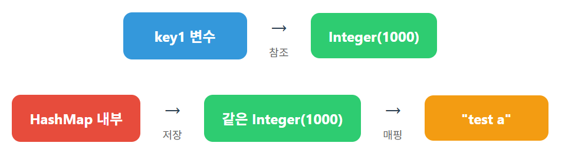

# 아이템 7

## 다 쓴 객체 참조를 해제하라

```java
public Object pop() {
    if (size == 0)
        throw new EmptyStackException();
    return elements[--size]; -> 여전히 elements[size] 객체는 살아있음
}

---

public Object pop() {
	  if (size == 0)
	      throw new EmptyStackException();
	  Object result = elements[--size];
	  elements[size] = null; // 다 쓴 참조 해제
	  return result;
}
```

가비지 컬렉터는 참조가 있으면 살아있는 객체라고 판단해서 버리지 않음

따라서 size를 줄인다고 해서 size보다 큰 기존의 있는 객체의 참조가 살아 있으므로 GC가 발생하지 않는다. 따라서 참조를 null로 해 GC가 발생하도록 해야함

null 처리해서 해당 객체를 더는 쓰지 않을 것임을 가비지 컬렉터에 알려야 한다.

캐시 역시 메모리 누수를 일으키는 주범이다.

**강한 결합 vs 약한 결합**

강한 결합 : 

```java
@Test
public void softTest() {
    HashMap<Integer, String> integerStringHashMap = new HashMap<>();
    Integer key1 = 1000;
    Integer key2 = 2000;

    integerStringHashMap.put(key1, "test a");
    integerStringHashMap.put(key2, "test b");

    key1 = null;

    System.gc();  //강제 Garbage Collection
    integerStringHashMap.entrySet().stream().forEach(el -> System.out.println(el));
}

---

결과
2000=test b
1000=test a -> 삭제되지 않았음
```

약한 결합

```java
@Test
public void softTest() {
    WeakHashMap<Integer, String> map = new WeakHashMap<>();
    Integer key1 = 1000;
    Integer key2 = 2000;

    map.put(key1, "test a");
    map.put(key2, "test b");

    key1 = null;

    System.gc();  //강제 Garbage Collection
    map .entrySet().stream().forEach(el -> System.out.println(el));
}

---

결과
2000=test b -> GC로 인하여 test a가 삭제된 것을 알 수 있음
```

→ 따라서 캐시를 사용할 때는 그냥 HashMap이 아니라 WeakHashMap을 사용해야 GC가 발생함

**HashMap의 저장구조**

- 최초 저장시



→ key1, HashMap이 같은 Integer를 바라보고 있음

- GC 발생시


→ key1 = null을 한다는 것은 key1의 참조값을 기존의 Integer의 주소에서 null로 바꾼다는 것을 의미 Integer 객체를 사라지게 한 것이 아니므로 Integer 객체는 여전히 살아있음. 따라서 HashMap에서는 Integer를 여전히 바라볼 수 있게 됨

**콜백에서의 관점**

콜백이란 메서드의 인자로 들어가는 메서드를 말함

```java
Client clientA = new Client("ClientA");
EventCallback callbackA = clientA.getCallback();
eventSystem.registerCallback(callbackA);

clientA = null;
```

- 초기상태


- clientA = null; 이후


clinetA가 callback 함수들을 불렀으므로 callback이 GC될 것이라고 생각하지만 그렇지 않고 

callbackA = null을 해도 GC가 되지 않음(캐시와 같은이유)