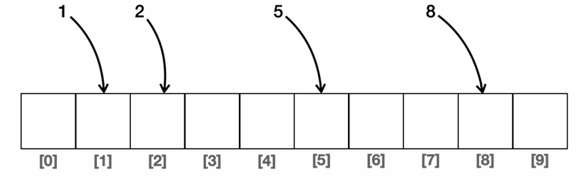

# Item 11. equals를 재정의하려거든 hashCode도 재정의하라

equals를 재정의한 클래스들에서 hashCode를 재정의하지 않으면 인스턴스를  HashMap, HashSet 등 해시를 사용하는 컬렉션의 원소로 사용할 때 문제가 생긴다. equals로 두 객체가 같다고 판단했다면 두 객체의 hashCode값은 같아야 한다.

# Hash와 Set

- Set은 데이터의 순서를 필요로 하지 않는다. 데이터의 유무만 판단하면 된다. 데이터의 유무를 판단할 때 어떻게 하면 빠르게 탐색할 수 있을까?
    
    → 배열, 리스트에서는 처음부터 끝까지 탐색하는 O(n)의 비용이 드는 탐색을 사용했겠지만, Set은 O(1) 연산만으로도 가능하다. 데이터의 값 자체를 배열의 인덱스와 맞춰서 저장하면 된다.
    
    
    

그런데, set의 범위가 매우 커진다고 생각하면 메모리의 낭비가 너무 심할 것이다. 때문에 배열의 크기는 키우지 않고, 해시인덱스를 사용한다. 0~100까지 저장하는 set이 있다고 할 때, 크기가 10인 배열이면 99의 해시인덱스는 99 % 10 = 9라고 생각하면 된다. 

그런데, 이렇게 하면 9, 19, 29 … 99 등의 데이터는 구분하지 못한다. 이를 해시충돌이라고 한다. 이를 해결하기 위해 2차원 배열을 사용한다. 9, 19, 29 … 99가 모두 set에 저장된다고 하면, 9번째 해시인덱스에 [9, 19, 29 … 99]가 저장된다.

하지만 이런 경우, 99를 탐색한다고 하면 O(n)의 연산을 수행하는 것이나 마찬가지다. 때문에 set에서 데이터가 고르게 분포되어있는 것이 좋다.

Effective Java의 예시를 보자.

```jsx
@Override public int hashCode() { return 42; }
```

이 코드는 늘 같은 hash값을 반환하므로, 사실상 배열에서 탐색하는 O(n) 연산을 수행하는 것이다.

```jsx
 Map<PhoneNumber, String> m = new HashMap<>();
 m.put(new PhoneNumber (707, 867, 5309), "제니");
 
 m.get(new PhoneNumber(707, 867, 5309)) // null
```

이 경우에서는 hashCode를 재정의하지 않았기 때문에, 객체의 참조값을 기반해 hash값을 생성한다. map에 put을 한 객체와 get에서 new를 한 객체는 다른 객체이므로 보통의 경우는 hash값도 다르다. 우연히 해시충돌로 인해 해시인덱스가 같아서 같은 버킷에 들어갔더라도, 해시값이 다르기 때문에 get을 했을 때 null을 반환한다. 만약 equals를 재정의한 상태에서 해시값까지 우연히 같다면 get은 제니를 반환할 것이다.

hashCode를 작성하는 요령은 다음과 같다.

- int 변수 result 선언 후, 객체 첫 핵심필드(equals에 포함되는 필드)를 Type.hashCode()에서 반환된 값으로 초기화, 나머지 핵심 필드들은 아래와 같은 작업을 수행한다.
    - 기본 타입 필드는 Type.hashCode() 수행
    - 참조타입 필드이면서 equals가 재귀적으로 호출된다면 hashCode도 재귀적으로 호출, 계산이 복잡해지면 표준형 만들기
        
        ```jsx
        class Address {
            String city;
            String street;
        
            @Override
            public boolean equals(Object o) { ... } // city, street 비교
            @Override
            public int hashCode() {
                return Objects.hash(city, street);
            }
        }
        
        class Person {
            String name;
            Address address; // 참조 타입 필드
        
            @Override
            public boolean equals(Object o) {
                if (!(o instanceof Person)) return false;
                Person p = (Person) o;
                return Objects.equals(name, p.name)
                    && Objects.equals(address, p.address); // address.equals() 호출
            }
        
            @Override
            public int hashCode() {
                int result = Objects.hashCode(name);
                // address가 null이 아니면 address.hashCode() 재귀적으로 호출
                result = 31 * result + Objects.hashCode(address);
                return result;
            }
        }
        
        ```
        
        ```jsx
        class Rational {
            int numerator;
            int denominator;
        
            // equals에서는 기약분수 기준으로 비교
            @Override
            public boolean equals(Object o) {
                if (!(o instanceof Rational)) return false;
                Rational r = (Rational) o;
                return numerator * r.denominator == denominator * r.numerator;
            }
        
            // hashCode에서도 기약분수(표준형)를 만들어서 그 기준으로 계산
            @Override
            public int hashCode() {
                int gcd = gcd(numerator, denominator);
                int num = numerator / gcd;
                int den = denominator / gcd;
                return Objects.hash(num, den);
            }
        }
        
        ```
        
    - 필드가 배열이면 핵심원소 각각을 별도 필드처럼 다룸
        
        ```jsx
        class PhoneBook {
            String owner;
            String[] numbers; // 배열 필드
        
            @Override
            public boolean equals(Object o) {
                if (!(o instanceof PhoneBook)) return false;
                PhoneBook pb = (PhoneBook) o;
                return Objects.equals(owner, pb.owner)
                    && Arrays.equals(numbers, pb.numbers); // 배열 비교
            }
        
            @Override
            public int hashCode() {
                int result = Objects.hashCode(owner);
                // 배열이면 Arrays.hashCode() 사용
                result = 31 * result + Arrays.hashCode(numbers);
                return result;
            }
        }
        
        ```
        
- 위처럼 계산한 해시코드로 result를 갱신한다. 예시는 다음과 같다.
    
    ```jsx
    @Override
    public int hashCode() {
        int result = Short.hashCode(areaCode);
        // 31은 shift 연산으로 컴파일러가 최적화해줌
        // String을 생각해보면 31을 곱해주지 않으면 anagram은 해시코드가 같아짐
        // 짝수 곱하면 해시충돌 확률 올라감
        result = 31 * result + Short.hashCode(prefix);
        result = 31 * result + Short.hashCode(lineNum);
        return result;
    }
    
    ```
    

그러나 intellij 자동생성을 확인해보면 Objects.hash를 사용한다.