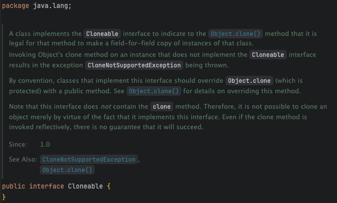

# Item13

> ***clone 재정의는 주의해서 진행해라***
<br>

## Cloneable

<br>




 **Cloneable** 인터페이스를 구현하면, 해당 클래스는 복제가 가능한 클래스임을 명시하게 된다. 이러한 용도로 사용되는 인터페이스를 마커 인터페이스라고 한다. 만약 **Cloneable**을 구현하지 않은 클래스의 **clone** 메서드를 호출하면, **`CloneNotSupportedException`**을 반환한다.

<br>

 관례에 따르면 **Cloneable**을 구현하는 클래스는 **Object** 클래스의 clone 메서드를 public으로 오버라이드 해야한다. 근데, 재정의한 clone 메서드의 정상적인 동작을 기대하기 위해서는 복잡하고, 강제할 수 없고, 허술하게 기술된 프로토콜을 따라야 한다고 한다.

생성자를 호출하지 않고도 특정 클래스 타입의 인스턴스를 얻을 수 있는데, 이거 괜찮을까? 라는 생각부터 든다.

<br>

clone 메서드에서 정의한 일반 규약은 아래와 같다.

1. `x.clone() ≠ x`
    
    → 복제된 객체는 원본 객체와는 다른 객체여야 한다.
    
2. `x.clone().getClass() == x.getClass()`
    
    → 복제된 객체는 원본 객체와 같은 클래스여야 한다. 
    
3. `x.clone.equals(x)`
    
    → 복제된 객체는 원본 객체와 논리적 동치여야 한다.

<br>
    

## 불안정성

```java
public class A implements Cloneable {
    private int value;
    private Object[] array;
    
    public A(int value, Object[] array) {
        this.value = value;
        this.array = array;
    }
    
    @Override
    public A clone() throws CloneNotSupportedException {
        return (A) super.clone();
    }
}
```

<br>

**A** 클래스는 **Cloneable**을 구현하고 있으며, **Object** 클래스의 **clone** 메서드를 오버라이드 하고 있다. 만약, **clone** 메서드를 통해 새로운 **A** 인스턴스를 할당받은 아래의 상황에서 발생할 수 있는 문제는 무엇일까?

<br>

```java
A a1 = new A(25, array); // array는 임의의 배열이라 가정
A a2 = a1.clone();
```

<br>

**a1**, **a2**는 각각 동일한 참조의 **Object** 배열을 참조하고 있다. 따라서, **a2**에서 해당 배열을 수정하면 이 사항이 **a1**에게도 그대로 반영된다는 점이다. 

<br>

이를 방지하기 위한 대안으로는 아래 세가지 방법이 있다.

<br>

**array의 clone 메서드를 호출하여 필드를 할당하기**

```java
    @Override
    public A clone() throws CloneNotSupportedException {
        A cloned = (A) super.clone();
        cloned.array = array.clone();
        return cloned;
    }
```

<br>

**필드를 final로 선언하기**

```java
public class A implements Cloneable {
    private int value;
    private final int[] array;
    
    @Override
    public A clone() throws CloneNotSupportedException {
        A cloned = (A) super.clone();
        cloned.array = array.clone();
        return cloned;
    }
}
```

<br>

이 경우, **final** 필드에 대한 재할당이 불가해 컴파일 에러를 발생시킨다.

<br>

**고수준 메서드 사용**

```java
    @Override
    public A clone() throws CloneNotSupportedException {
        A result = (A) super.clone();
        

        result.array = new int[this.array.length];  // 빈 배열로 초기화
        
        result.setValue(this.value);
        
        for (int i = 0; i < this.array.length; i++) {
            result.setElementAt(i, this.array[i]); 
        }
        
        return result;
    }
```

<br>

여기서 의미하는 고수준 메서드는 원본의 값을 가져와 복사본의 값으로 복사하는 것을 의미한다. 

<br>

## 일반 규약

### 1. clone 메서드에서 재정의 가능한 메서드를 호출하지 않는다.

<br>

 만약, **clone** 메서드가 하위 클래스에서 재정의한 메서드를 호출하면, 하위 클래스는 복제 과정에서 자신을 교정할 기회를 읽게 되어 원본과 복제본의 상태가 달라질 가능성이 크다. 따라서, 호출할 메서드는 **private**이거나 **final**이어야 한다. 

```java
@Override
public Object clone() {
    Object result = super.clone();
    // private/final 메서드만 호출
    return result;
}
```

<br>

### 2. 재정의한 clone 메서드에서는 throws를 안해도 무방하다.

<br>

**Object** 클래스에서는 **CloneNotSupportedException**을 반환할 수도 있지만, **Cloneable**을 **implements** 하고 **clone** 메서드를 **재정의**하는 경우에는 **CloneNotSupportedException**을 반환할 일이 없기 때문이다.

<br>

```java
@Override
public Object clone() {
    try {
        return super.clone();
    } catch (CloneNotSupportedException e) {
        throw new AssertionError(); // 도달 불가능
    }
}
```

<br>

### 3. 상속용 클래스는 Cloneable을 구현해서는 안된다.

<br>

 **Object** 클래스에서 동작하지 않는 **clone** 메서드를 정의하고 하위 클래스가 이를 재정의했던 것 처럼 구현하거나, 호출시 예외를 던져 비활성화할 수도 있다.

 <br>

```java
@Override
protected Object clone() throws CloneNotSupportedException {
    return super.clone();
}

@Override
protected Object clone() throws CloneNotSupportedException {
    return super.clone();
}
```

<br>

### 4. clone 메서드를 동기화 하라.

<br>

아래의 코드를 살펴보자.

```java
public class UnsafeCloneExample {
    private int value1;
    private int value2;
    
    @Override
    public Object clone() {
        try {
            return super.clone();  // 스레드 안전하지 않음
        } catch (CloneNotSupportedException e) {
            throw new AssertionError();
        }
    }
    
    public void updateValues(int v1, int v2) {
        this.value1 = v1;  // 이 시점에서 clone이 실행되면
        // 일관성 없는 상태 복제 가능
        this.value2 = v2;
    }
}
```

<br>

만약 **updateValues** 메서드가 호출되어 실행되는 도중에 **clone** 메서드가 호출되면, 서로 다른 상태의 인스턴스가 생긴다. 따라서 **synchronized** 키워드를 사용하거나 **블록**을 활용하여 스레드 안정성을 보장해야 한다.

<br>

### 5. 복사 생성자와 복사 팩터리를 활용하라.

<br>

**clone** 메서드를 재정의 하는 대신 **복사 생성자**와 **복사 팩터리**를 고려해볼 수 있다. 언어 모순적이고 위험한 객체 생성 메커니즘을 사용하지 않으며, 간결하고 안정적이다. 

<br>

```java
// 복사 생성자
public MyClass(MyClass original) {
    this.field1 = original.field1;
    this.field2 = original.field2;
}

// 복사 팩터리
public static MyClass newInstance(MyClass original) {
    return new MyClass(original);
}
```

<br>

추가적으로 관례상 모든 범용 컬렉션 구현체는 **Collection**이나 **Map** 타입을 받는 생성자를 제공한다. 이를 인터페이스 기반 복사 생성자/팩터리라고 하는데, 정확한 명칭은 **변환 생성자**와 **변환 팩터리**이다. 

<br>

생각보다 심심치 않게 그 활용을 찾아 볼 수 있다.

```java
// 실제 Collection을 매개변수로 받는 TreeSet 생성자
public TreeSet(Collection<? extends E> c) {
    this();
    addAll(c);
}
```

```java
// HashSet을 TreeSet으로 변환
Set<String> hashSet = new HashSet<>();
Set<String> treeSet = new TreeSet<>(hashSet);
```
