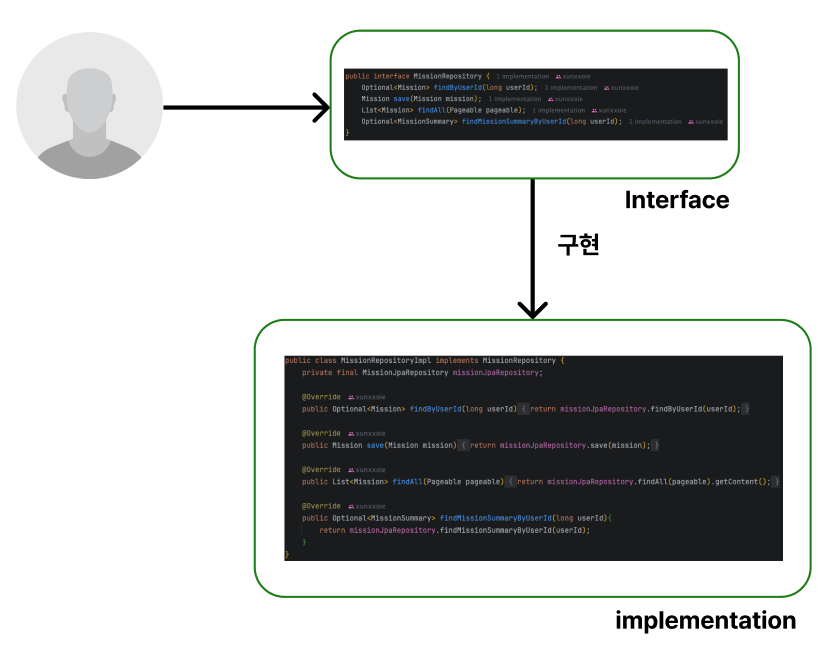

# Item15

> ***클래스와 멤버의 접근 권한을 최소화하라***

<br>

## 잘 설계된 컴포넌트

<br>

 어설프게 설계된 컴포넌트와 잘 설계된 컴포넌트의 가장 큰 차이는 클래스 내부 데이터와 구현 정보를 외부 컴포넌트로부터 얼마나 잘 숨겼느냐로 판단한다고 한다. 

<br>



<br>

 대영한 강사님께서 예시로 들었던 **역할**과 **배우**의 분리 예시와 일맥상통한다. 무대를 구성할 때, **역할**(인터페이스)를 먼저 구성하고, 적합한 **배우**(구현체)를 캐스팅하여 무대를 완성한다. 실질적인 구현을 클라이어트에게 숨기는 **캡슐화**는 소프트웨어 설계의 근간이 되는 원리이다.

<br>

**캡슐화**의 장점은 아래와 같다. 

- 시스템 개발 **속도**를 높인다.
- 시스템 관리 **비용**을 낮춘다.
- 성능 자체의 영향을 주지는 않지만, **성능 최적화**에 도움을 준다.
- 소프트웨어 **재사용성**을 높인다.
- 큰 시스템을 제작하는 **난이도**를 낮춰준다.

<br>

## 자바의 캡슐화 도구

<br>

### 접근 제어자

<br>

 **접근 제어자**란 **클래스**, **인터페이스**, **맴버**의 접근 허용 범위를 제어하는 키워드이다. **public**, **private**, **protected**, **default**가 있으며, 각 키워드가 제한하는 범위는 아래와 같다. 

<br>

- **public**
    
    → 제한 없이 모든 범위에서 접근이 가능하다.
    
- **private**
    
    → 같은 클래스 내에서만 접근이 가능하다.
    
- **protected**
    
    → 같은 패키지 내에서만 접근이 가능하다.
    
    → 상속 관계가 있다면, 패키지가 달라도 접근이 가능하다.
    
- **default**(**package-private**)
    
    → 같은 패키지 내에서만 접근이 가능하다.
    
    → 상속 관계가 있어도 패키지가 다르면 접근이 불가능하다.

<br>

### 접근 제어자 기본 원칙

<br>

 모든 클래스와 멤버의 접근성을 가능한 좁혀야 한다. 다르게 말하면, 소프트웨어가 설계대로 동작하는 한 가장 낮은 접근 수준으로 제어해야 한다는 뜻이다.

<br>

 탑 레벨 클래스와 인터페이스에 부여할 수 있는 접근 수준은 **public**과 **default**이다. 외부 패키지에서 접근하는 경우가 없다면 **default**로, 있다면 **public**으로 제어한다.

<br>

 다시 말해, **default**로 설정한다는 것은 내부 구현임을 명시하며, 이에 대한 수정과 교체가 자유롭게 일어날 수 있다. 하지만, **public**으로 설정한다는 것은 외부에서 사용할 수 있는 API임을 명시하며, 수정과 교체가 발생한다면 API 문서를 수정하든 직접 알리든 해야한다. 

<br>

 다만, 한가지 제약사항이 있다. **상속**(상위 클래스 - 하위 클래스) 관계에서 하위 클래스가 상위 클래스의 메서드를 재정의하는 경우, 상위 클래스 메서드의 접근 제어자보다 하위(더 제한적인)의 접근 제어자를 사용할 수 없다는 것이다.

<br>

```java
class Parent {
    protected void method() {
        System.out.println("Parent method");
    }
}

class Child extends Parent {
    private void method() {
        System.out.println("Child method");
    }
    // Cannot reduce the visibility of the inherited method from Parent
}
```

<br>

 이는 상위 클래스의 인스턴스는 하위 클래스의 인스턴스로 대체해 사용할 수 있어야 한다는 **리스코프 치환 원칙**을 지키기 위해서이다. 아래와 같은 경우에 컴파일 에러가 난다.

<br>

 역할과 배우를 정확하게 분리하기 위해(유지보수성을 높이고, 다형성을 최대한 활용하기 위해), 역할을 정확하게 설계한 후 구현을 private으로 두자. 잘 설계된 컴포넌트의 판단을 위해 다음과 같은 기준을 제시할 수 있다.

<br>

> ***public으로 접근 제어자를 열어둬야 함이 자주 강제되는가?***

<br>

필수적인 상황을 제외하고 이러한 일이 많이 발생한다면, 역할의 설계에 대해 재고해볼 여지가 있다고 한다.

<br>

## 몇가지 규칙

<br>

### public 클래스의 인스턴스 필드는 되도록 public이 아니어야 한다.

<br>

 필드가 가변 객체를 참조하거나 **final** 키워드가 붙지 않은 필드를 **public**으로 선언하면 해당 필드를 통제할 수 있는 힘을 잃게 된다. 아래 예시를 보자.

<br>

```java
// 잘못된 예시
public class Student {
    public String name;        // 값 제한 불가
    public List<String> grades;  // 가변 객체 참조
}

// 사용 시 문제점
Student student = new Student();
student.name = "";           // 빈 문자열도 허용
student.name = null;         // null도 허용
student.grades.add("F+");    // 잘못된 성적도 추가 가능
```

<br>

 가변 필드에 대한 작업이 필요하면 해당 필드를 **private**로 제한하고, 해당 필드에 대한 작업을 할 수 있는 메서드를 정의하여 사용하는 것이 바람직하다. 

<br>

```java
// 올바른 예시
public class Student {
    private String name;
    private final List<String> grades = new ArrayList<>();
    
    public void setName(String name) {
        if (name == null || name.trim().isEmpty()) {
            throw new IllegalArgumentException("이름은 필수입니다");
        }
        this.name = name;
    }
    
    public void addGrade(String grade) {
        if (!isValidGrade(grade)) {
            throw new IllegalArgumentException("유효하지 않은 성적입니다");
        }
        grades.add(grade);
    }
}
```

<br>

핵심은 필드에 대한 제어권을 갖는 것이다. **public** 필드는 외부에서 임의로 조작이 가능하기 때문에 데이터 무결성과 스레드 안전성을 보장할 수 없다.

<br>

### 클래스에서 public static final 배열 필드를 두거나 이를 반환하는 메서드를 제공해서는 안된다.

<br>

만약, 수정되면 절대 안되는 배열 필드가 아래처럼 있다고 가정해보자

```java
public class SecurityConfig {
    public static final String[] ADMIN_USERS = {"admin", "root", "manager"};
}
```

<br>

이런식으로 배열을 정의하고 사용하면, 아래와 같은 참사가 발생할 수 있다.

<br>

```java
SecurityConfig.ADMIN_USERS[0] = "hacker";
SecurityConfig.ADMIN_USERS[1] = null; 
```

<br>

배열 자체는 **final**이지만, 배열 내부의 원소들은 언제 어디서나 참조와 수정이 가능하다. 따라서, 배열 필드를 **private**로 설정하고 방어적 복사를 통해 원소에 접근하도록 하자.

<br>

### 모듈

<br>

**Java 9**에서는 모듈이라는 개념이 도입되면서, 두 가지의 암묵적 접근 수준이 추가되었다. 

<br>

- 모듈 내부로 제한된 **public**
    
    → export되지 않은 패키지의 **public** 맴버
    
- 모듈 내부로 제한된 **proteced**
    
    → export되지 않은 패키지의 **protected** 맴버
    

**모듈**이란 **패키지의 묶음**이다. **모듈**은 자신에 속하는 패키지 중 공개할 것들을 선언한다. **protected**, **public** 맴버라도 해당 모듈에서 **export**를 하지 않았다면 해당 모듈 밖에서는 접근할 수가 없다.
