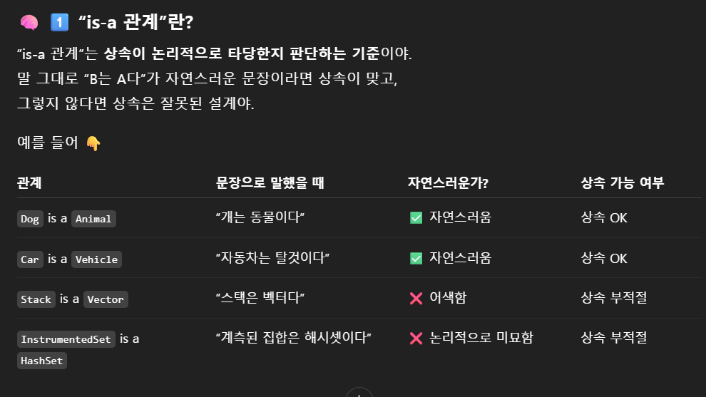

# Item 18. 상속보다는 컴포지션을 사용하라

- Item 18에서 말하는 상속은 인터페이스를 구현하는 것이 아닌 클래스가 다른 클래스를 확장하는 구현 상속을 의미함.

- 상위, 하위 클래스를 모두 같은 프로그래머가 통제하는 경우
- 확장할 목적으로 설계, 문서화가 잘 된 클래스인 경우
    
    → 상속은 안전하고 코드를 재사용하기 좋은 방법임.
    
    → 다른 개발자가 관리하는 상위클래스를 상속한다면 문제가 생길 수 있음. 캡슐화가 깨질 수 있음.
    

```jsx

public class InstrumentedHashSet<E> extends HashSet<E> {

    private int addCount = 0;

    public InstrumentedHashSet() {
    }

    public InstrumentedHashSet(int initCap, float loadFactor) {
        super(initCap, loadFactor);
    }

    @Override
    public boolean add(E e) {
        addCount++;
        return super.add(e);
    }

    @Override
    public boolean addAll(Collection<? extends E> c) {
        addCount += c.size();
        return super.addAll(c);
    }

    public int getAddCount() {
        return addCount;
    }
}

InstrumentedHashSet<String> s = new InstrumentedHashSet(); 
s.addAll(List.of("틱", "탁탁", "펑"));

getAddCount를 호출하면 정상적인 값은 3이지만, 이 코드를 실행하면 6이 될 것임.

-> HashSet의 addAll은 add 메서드를 이용해 구현돼있음.
-> s.addAll을 호출하면, 먼저 addCount에 3이 더해짐.
-> 이후 super.addAll을 실행하면 InstrumentedSet에 재정의돼있는 add가 사용됨.
-> 매 요소마다 addCount + 1이 됨. 즉 3 + 1 + 1 + 1로 addCount는 6이 되는 것
```

- 위와 같은 예시처럼, 상위 클래스의 내부 구현을 확인하지 않고 상속하면 원하는대로 동작하지 않는 경우가 생길 수 있음.
    
    → 상위 클래스 내부 구현에 의존
    

- 보안때문에 컬렉션에 추가된 모든 원소가 특정 조건을 만족해야하는 프로그램을 생각해보자.
    
    ```jsx
    public class SafeList<E> extends ArrayList<E> {
        @Override
        public boolean add(E e) {
            if (!isAllowed(e)) throw new SecurityException();
            return super.add(e);
        }
    
        @Override
        public void add(int index, E element) {
            if (!isAllowed(element)) throw new SecurityException();
            super.add(index, element);
        }
    
        private boolean isAllowed(E e) {
            // 보안 검사 로직
            return e != null;
        }
    }
    
    // ArrayList에서 새로운 메서드가 추가됐다고 가정
    public boolean addAllAtEnd(Collection<? extends E> c) {
        // 내부적으로 add()를 안 쓰고, low-level 배열 연산으로 원소 추가
    }
    
    SafeList<String> list = new SafeList<>();
    list.addAllAtEnd(List.of("HACKED")); // ✅ 재정의되지 않은 새 메서드 사용
    ```
    

- 위 두 문제는 메서드 재정의로 인한 문제, 그럼 메서드 재정의를 하지 않고 다른 방법을 사용한다면?
    
    → 상위 클래스에 메서드가 추가된 메서드가 하위클래스에 추가한 메서드와 시그니처가 같고 반환 타입 다르면 컴파일도 안됨.
    

위의 문제들을 해결하기 위해 컴포지션을 사용해야 함.

- 컴포지션
    
    ```jsx
    // 래퍼 클래스
    public class InstrumentedSet<E> extends ForwardingSet<E> {
        private int addCount = 0;
    
        public InstrumentedSet(Set<E> s) {
            super(s);
        }
    
        @Override
        public boolean add(E e) {
            addCount++;
            return super.add(e);
        }
    
        @Override
        public boolean addAll(Collection<? extends E> c) {
            addCount += c.size();
            return super.addAll(c);
        }
    
        public int getAddCount() {
            return addCount;
        }
    }
    
    // 전달 클래스
    public class ForwardingSet<E> implements Set<E> {
        private final Set<E> s;
    
        public ForwardingSet(Set<E> s) {
            this.s = s;
        }
    
        @Override
        public void clear() {
            s.clear();
        }
    
        @Override
        public boolean contains(Object o) {
            return s.contains(o);
        }
    
        @Override
        public boolean isEmpty() {
            return s.isEmpty();
        }
    
        @Override
        public int size() {
            return s.size();
        }
    
        @Override
        public Iterator<E> iterator() {
            return s.iterator();
        }
    
        @Override
        public boolean add(E e) {
            return s.add(e);
        }
    
        @Override
        public boolean remove(Object o) {
            return s.remove(o);
        }
    
        @Override
        public boolean containsAll(Collection<?> c) {
            return s.containsAll(c);
        }
    
        @Override
        public boolean addAll(Collection<? extends E> c) {
            return s.addAll(c);
        }
    
        @Override
        public boolean removeAll(Collection<?> c) {
            return s.removeAll(c);
        }
    
        @Override
        public boolean retainAll(Collection<?> c) {
            return s.retainAll(c);
        }
    
        @Override
        public Object[] toArray() {
            return s.toArray();
        }
    
        @Override
        public <T> T[] toArray(T[] a) {
            return s.toArray(a);
        }
    
        @Override
        public boolean equals(Object o) {
            return s.equals(o);
        }
    
        @Override
        public int hashCode() {
            return s.hashCode();
        }
    
        @Override
        public String toString() {
            return s.toString();
        }
    }
    
    ```
    

위처럼 구현한다면 addCount와 HashSet은 분리되고, 우리가 원하던 기능을 안정적으로 추가할 수 있음. getAddCount를 호출하면 정상적으로 3이 반환될 것임.

전달 클래스라는 중간 다리를 놓고, 구현체와 우리가 추가로 넣어야 할 기능에 대해 필드로 추가

→ 구현체(상위 클래스)의 내부 구현에 의존하지 않고 안정적으로 상속의 효과를 낼 수 있음

→ 이를 데코레이터 패턴이라고도 함.

다만, 래퍼클래스는 콜백 프레임워크와 같이 사용하면 문제가 발생할 수 있음.

→ 콜백 프레임워크는 객체를 내가 아니라 프레임워크가 호출해주는건데, 콜백 프레임워크에서는 래퍼 클래스가 아니라 HashSet같은 내부 구현체를 전달해주는 경우가 있다고 함.

→ 근데 그냥 래퍼클래스 하나 더 만들어서 그 래퍼클래스 전달해주면 되는 거 아닌가..? 내부 구현체를 전달해야만 하는 경우가 있나보네요 이 부분은 솔직히 찾아봐도 잘 모르겠습니다 ..

- 상속은 반드시 하위 클래스가 상위 클래스의 진짜 하위타입인 상황에서만 쓰여야 함.
    
    
    
- B가 A를 상속해서는 안된다면, A를 private 인스턴스로 두고, A와는 다른 API를 제공할 것
    
    → 컴포지션을 사용하라는 의미
    

- 컴포지션 대신 상속을 사용하기로 결정했다면 아래의 질문에 자문할 것
    - 확장하려는 클래스의 API에 아무런 결함이 없는가?
    - 결함이 있다면, 이 결함이 내 클래스 API까지 전파돼도 괜찮은가?