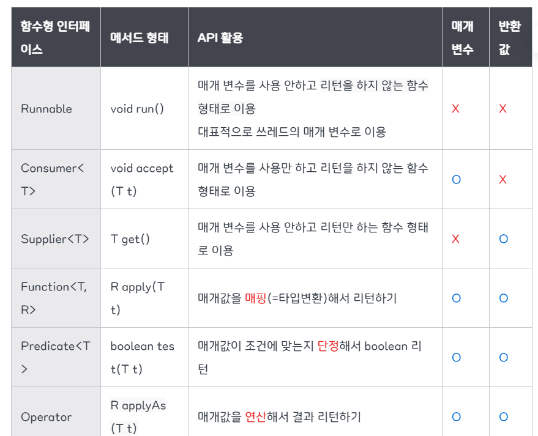

# Item 43. 람다보다는 메서드 참조를 이용하라

- 익명클래스를 간단하게 사용 → 람다
- 람다를 더 간단하게 사용 → 메서드 참조

```jsx
// 익명클래스 버전
map.merge(key, 1, new BiFunction<Integer, Integer, Integer>() {
    @Override
    public Integer apply(Integer count, Integer incr) {
        return count + incr;
    }
});

// 람다 버전
map.merge(key, 1, (count, incr) -> count + incr);

// 메서드 참조 버전
map.merge(key, 1, Integer::sum);
```

- 함수형 인터페이스 덕분에 익명클래스를 람다로 구현 가능
- 함수형 인터페이스란 정의되어 있는 추상 메서드가 단 하나인 인터페이스
    
    → 추상 메서드가 단 하나이므로, 람다식이 어떤 메서드를 구현했는지 혼동하지 않음.
    
    → 단, 함수형 인터페이스에 정의돼있는 인자 타입/개수, 반환 타입은 일치해야 함
    
    ```jsx
    @FunctionalInterface
    public interface Supplier<T> {
    	T get();
    }
    ```
    

- 자바에서 제공하는 함수형 인터페이스의 종류는 아래와 같음. 각 인터페이스의 세부 종류는 생략함.



- 람다는 함수형 인터페이스의 추상 메서드를 재정의하는 것
    
    → 메서드 참조는 이미 존재하는 메서드를 이용해 함수형 인터페이스의 추상 메서드를 구현한 것
    
    → 이미 존재하는 메서드와 함수형 인터페이스의 추상 메서드는 인자 타입/개수, 반환 타입이 같아야 함
    
- 보통은 람다보다 메서드 참조가 더 간결하지만, 그렇지 않은 경우가 있음
    
    → 메서드와 람다가 같은 클래스에 있고, 클래스명이 길 때 람다가 더 간결한 경우도 있음
    
    ```jsx
    class GoshThisClassNameIsHumongous {
        public static void action() {
            System.out.println("Action!");
        }
    
        public void runTask(ExecutorService service) {
    		    // 메서드 참조
            service.execute(GoshThisClassNameIsHumongous::action);
            // 람다
            service.execute(() -> action());
        }
    }
    
    ```
    

- 메서드 참조 유형


- 한정적 메서드 참조는 이미 생성된 객체의 메서드를 참조
    
    ```jsx
    Instant now = Instant.now();
    
    Predicate<Instant> p = now::isAfter;
    ```
    

- 비한정적 메서드 참조는 아직 생성되지 않은 객체의 메서드를 참조
    
    ```jsx
    // 인자가 두개인 이유는 Instant 객체 하나, isAfter 인자 하나
    BiPredicate<Instant, Instant> p = Instant::isAfter;
    ```
    

- 대부분 람다로 할 수 없는 일이면 메서드 참조로도 할 수 없으나, 예외가 있음.
    
    → 람다 내에서 제네릭 함수(타입 파라미터)를 구현하는 것
    
    - 자바 문법에서는 람다 내에서 타입 매개변수를 선언할 수 없음.
    - 람다는 함수형 인터페이스의 형태를 맞춰 기능을 간단히 구현하기 위한 용도이기 때문
    - 메서드 참조는 일반적인 메서드를 참조하는 것이므로 제네릭 메서드로 구현 가능
    
    ```jsx
    // 제네릭 클래스
    class Container<T> {
        private T data;
    
        public Container(T data) {
            this.data = data;
        }
    
        public T getData() { return data; }
    
        // 제네릭 메서드
        public <U> void printPair(U other) {
            System.out.println("Data = " + data + ", Other = " + other);
        }
    
    ```
    

아래는 발표 중 코멘트들

---


이거 구글에다가 검색하는게 재미나이가 답변해주는건가??

```java
함수형 인터페이스 

어떻게 쓰든간에 입력 매개변수, 반환값의 타입 -> T
```

```java
@FunctionalInterface
interface Calculator {
    int calculate();
}

// 2. 람다식 사용
public class LambdaExample {
    public static void main(String[] args) {
        int a = 10;
        int b = 20;
        
        // 람다식으로 표현
        Calculator lambda = () -> a + b;
        System.out.println("람다식 결과: " + lambda.calculate());
        
        // 익명 클래스로 풀어쓴 형태 (람다식의 본질)
        Calculator anonymous = new Calculator() {
            @Override
            public int calculate() {
                return a + b;
            }
        };
        System.out.println("익명 클래스 결과: " + anonymous.calculate());
    }
}
```

근데 전 왜 재정의라는건지 이해가 안댐 by 두옹균

약간 틀을 바꾸는게 재정의인데 틀이 고정되어 있지 않나

정확합니다.

람다식은 함수형 인터페이스의 **구현체**를 간결하게 표현하는 문법입니다. '재정의'라는 표현은 부정확하며, 올바른 개념은 다음과 같습니다.

람다는 함수형 인터페이스를 '재정의'한 것이 아니라, **추상 메서드가 하나인 함수형 인터페이스의 구현을 간결하게 표현한 것**입니다. 람다식은 코드 한 줄로 함수형 인터페이스의 추상 메서드를 구현하여, 별도의 클래스 없이도 익명 함수처럼 활용할 수 있게 해주는 문법입니다.

이 말이 맞는지 검토해줘

By 지피티

람다식은 **함수형 인터페이스의 추상 메서드를 “구현(implement)“한 것**이에요.

정확히 말하면 “재정의(override)“라고 하기보다는, 해당 인터페이스의 **추상 메서드를 구현하는 익명 객체를 간단히 표현한 문법**이에요.

예를 들어,

```java
@FunctionalInterface
interface MyFunc {
    void run();
}

1. (a, b) -> a+b
MyFunc f1 = new MyFunc() {
    @Override
    public void run() {
        return a + b;
    }
};

2. (a, b) -> a*b
MyFunc f1 = new MyFunc() {
    @Override
    public void run() {
        return a * b;
    }
};

재정의 -> 반환타입 정해져있고, 그리고 
```

보통은 익명 클래스 형태로 이렇게 구현하죠:

```java
MyFunc f1 = new MyFunc() {
    @Override
    public void run() {
        System.out.println("Hello");
    }
};
```

→ 여기서는 run()을 **재정의**한 게 맞습니다.

람다식으로 쓰면 이렇게 줄어들어요:

```java
MyFunc f2 = () -> System.out.println("Hello");
```

→ 사실 내부적으로는 익명 클래스 객체가 만들어지고, 그 객체의 run() 메서드가 구현된 거예요.

즉, **람다식은 함수형 인터페이스의 추상 메서드를 재정의한 익명 클래스 객체를 더 간단히 표현한 것**이라고 이해하면 됩니다.

여기를 봐주세요

******

### **1. “재정의(override)“의 의미**

- **상속 관계**에서,
    
    부모 클래스나 인터페이스의 메서드를 자식 클래스가 다시 작성하는 것.
    
- 즉, 이미 존재하는 메서드를 “덮어쓴다”는 개념.

```java
class Parent {
    void hello() { System.out.println("Hi"); }
}

class Child extends Parent {
    @Override
    void hello() { System.out.println("Hello"); }
}
```

➡️ 이 경우는 “재정의(override)” 맞습니다.

### **2. “구현(implement)“의 의미**

- 인터페이스에 있는 **추상 메서드**는 “형태(시그니처)“만 있고 “내용”은 없습니다.
- 따라서 클래스나 익명 객체가 그 메서드의 **실제 동작을 처음으로 작성**하는 것은 “구현”이라고 부릅니다.

```java
@FunctionalInterface
interface MyFunc {
    void run();
}

MyFunc f = () -> System.out.println("Hello");
```

### **3. 그래서 람다는 “구현”이지 “재정의”가 아님**

- **재정의(override)**: 이미 구현된 메서드가 있고, 그것을 덮어쓰는 경우 (상속 구조).
- **구현(implement)**: 인터페이스의 추상 메서드처럼 아직 몸체가 없는 메서드를 **처음 작성하는 경우**.
- 함수형 인터페이스의 메서드는 “아직 구현이 없는 추상 메서드”라서, 람다가 하는 건 **구현**이 맞습니다.

<코딩기준>

퍼플렉 <<<<<< 제미나이 <<<<<<<<<넘사벽<<<<<<<< 지피티 <<< 클로드 = GOAT

4.5 얘 잘함…

 배고프다 ..

클로드 짱 

? 지피티 잘 함 ㄴㄴ 쓰레기 같음

나 지피티 밖에 안씀 (유료 재미나이 받아놓고 안씀)

퍼플렉은 진짜 등신임 (코드 기준)

<자소서>

퍼플렉시티 ← GOAT