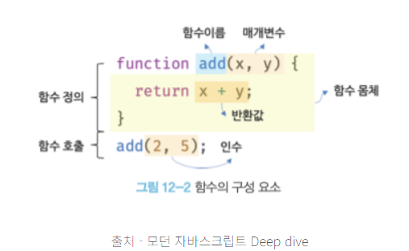

# Item 53. 가변인수는 신중히 사용하라

- 가변인수 메서드는 인수의 개수가 달라질 수 있는 메서드다. 예시는 아래와 같다.
    
    ```jsx
    static int sum(int... args) {
    	int sum = 0;
    	for (int sum arg : args)
    		sum += arg;
    	return sum;
    }
    ```
    

- 가변인수 메서드를 설계할 때 인수를 0개만 받도록 하는 것도 가능하게 설계하는 건 좋지 않다.
    
    ```jsx
    static int min(int... args) {
    	// 인수 0개 넣어 호출하면 런타임에 실패
    	// 코드도 지저분해짐
    	// 명시적으로 args 유효성 검사를 명시해야 함
    	if (args.length == 0)
    		throw new IllegalArgumentException("인수가 1개 이상 필요합니다.");
    	int min = args[0];
    	for (int i = 1; i < args.length; i++)
    		if (args[i] < min)
    			min = args[i];
    	return min;
    } 
    
    // min의 초깃값에 Integer.MAX_VALUE를 사용한 예시
    static int min(int... args){
    	if (args.length == 0)
    		throw new IllegalArgumentException("인수가 1개 이상 필요합니다.");
    	int min = Integer.MAX_VALUE;
    	// for-each문 사용
    	// min을 args[0]으로 사용했다면 for-each문은 처음에 args[0] 자기 자신을 비교했을 것, 비효율적
    	// 책에서 말한 MAX_VALUE를 사용하지 않았다면 명료한 for-each를 사용하지 못한다는 것은 이런 의미
    	for (arg : args)
    		if (arg < min)
    			min = arg;
    	return min;
    	
    
    ```
    
- 위의 코드를 제대로 사용하도록 변경한 코드
    
    ```jsx
    // 전체의 가변인수를 하나의 인수와 나머지 가변인수로 분리
    // 인수 0개 사용하면 런타임 실패 X, 컴파일 실패
    // args 유효성 검사 필요 X
    static int min(int firstArg, int... remainingArgs) {
        int min = firstArg;
        for (int arg : remainingArgs) {
            if (arg < min) 
                min = arg;
        }
        return min;
    }
    ```
    

- 그러나 가변인수 메서드는 호출될 때마다 배열을 하나 새로 생성한다. 성능에 민감한 상황이라면 개선할 방법이 있다.
    
    ```jsx
    // 일반적인 경우를 위한 오버로딩
    public void foo() { }
    public void foo(int a1) { }
    public void foo(int a1, int a2) { }
    public void foo(int a1, int a2, int a3) { }
    
    // 그 이상은 가변인수
    public void foo(int a1, int a2, int a3, int... rest) { }
    ```
    
    - 위 예시에서 통계적으로 인수를 3개 이상 사용하지 않는 메서드 호출이 95%라면, 새로 배열을 생성하는 메서드 호출은 5%일 것이다.
    - EnumSet도 위 기법을 사용해 열거타입 집합 생성 비용을 최소화한다.
        
        ```jsx
        // EnumSet.java 실제 코드
        
        public static <E extends Enum<E>> EnumSet<E> of(E e) {
            EnumSet<E> result = noneOf(e.getDeclaringClass());
            result.add(e);
            return result;
        }
        
        public static <E extends Enum<E>> EnumSet<E> of(E e1, E e2) {
            EnumSet<E> result = noneOf(e1.getDeclaringClass());
            result.add(e1);
            result.add(e2);
            return result;
        }
        
        public static <E extends Enum<E>> EnumSet<E> of(E e1, E e2, E e3) {
            EnumSet<E> result = noneOf(e1.getDeclaringClass());
            result.add(e1);
            result.add(e2);
            result.add(e3);
            return result;
        }
        
        public static <E extends Enum<E>> EnumSet<E> of(E e1, E e2, E e3, E e4) {
            // ...
        }
        
        public static <E extends Enum<E>> EnumSet<E> of(E e1, E e2, E e3, E e4, E e5) {
            // ...
        }
        
        // 5개 이상은 가변인수!
        @SafeVarargs
        public static <E extends Enum<E>> EnumSet<E> of(E first, E... rest) {
            EnumSet<E> result = noneOf(first.getDeclaringClass());
            result.add(first);
            for (E e : rest)
                result.add(e);
            return result;
        }
        ```
        
        → 개인적으로는 EnumSet을 생성하는 것 자체는 많이 호출될 것 같지도 않은데, 기존에 사용하던 비트필드 방식에 성능을 가깝게 맞추려고 이렇게 한 것 같습니다. 
        
        ```jsx
        // 비트 필드 방식
        public class Calendar {
            public static final int MONDAY    = 1 << 0;  // 1
            public static final int TUESDAY   = 1 << 1;  // 2
            public static final int WEDNESDAY = 1 << 2;  // 4
            public static final int THURSDAY  = 1 << 3;  // 8
            public static final int FRIDAY    = 1 << 4;  // 16
            public static final int SATURDAY  = 1 << 5;  // 32
            public static final int SUNDAY    = 1 << 6;  // 64
            
            // 반복 일정 설정
            public void setRecurringDays(int days) {
                // days = 31 이면? 
                // 디버깅 시 어떤 요일인지 알 수 없음
            }
        }
        
        // 사용
        calendar.setRecurringDays(MONDAY | WEDNESDAY | FRIDAY);  // 21
        // 데이터베이스에 21 저장 - 나중에 보면 무슨 의미인지?
        
        // EnumSet 방식
        public class Calendar {
            public enum Day { 
                MONDAY, TUESDAY, WEDNESDAY, THURSDAY, FRIDAY, SATURDAY, SUNDAY 
            }
            
            public void setRecurringDays(EnumSet<Day> days) {
                // 명확하고 타입 안전!
            }
        }
        
        // 사용
        calendar.setRecurringDays(
            EnumSet.of(Day.MONDAY, Day.WEDNESDAY, Day.FRIDAY)
        );
        
        // 순회도 쉬움
        for (Day day : recurringDays) {
            System.out.println("알람 설정: " + day);
        }
        ```
        
- 참고 - 인수와 인자(매개변수)의 차이

